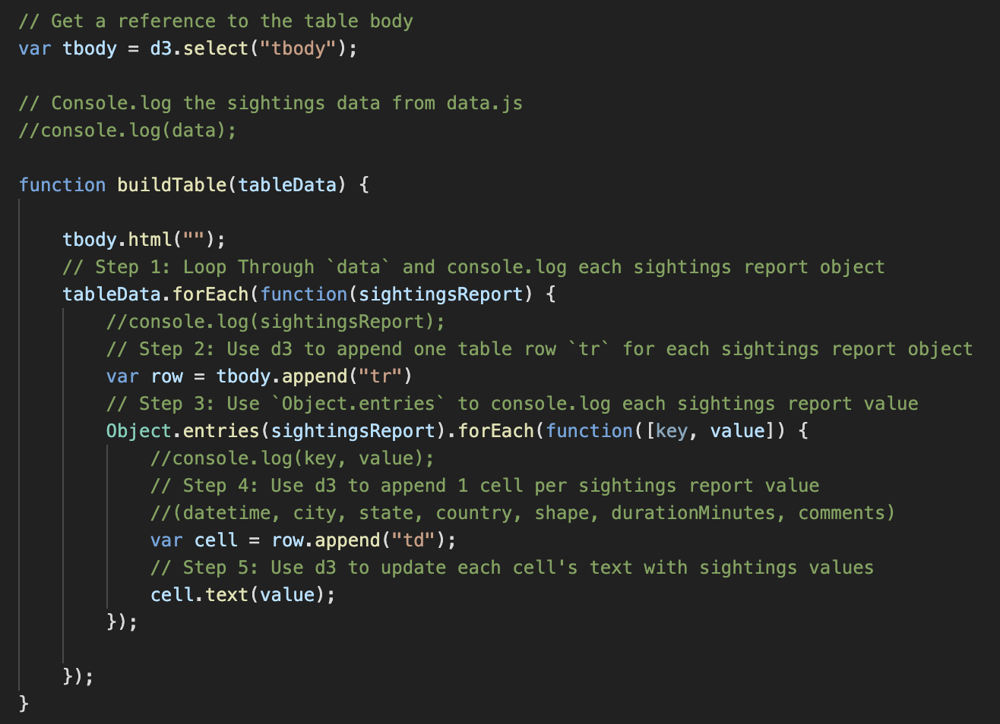
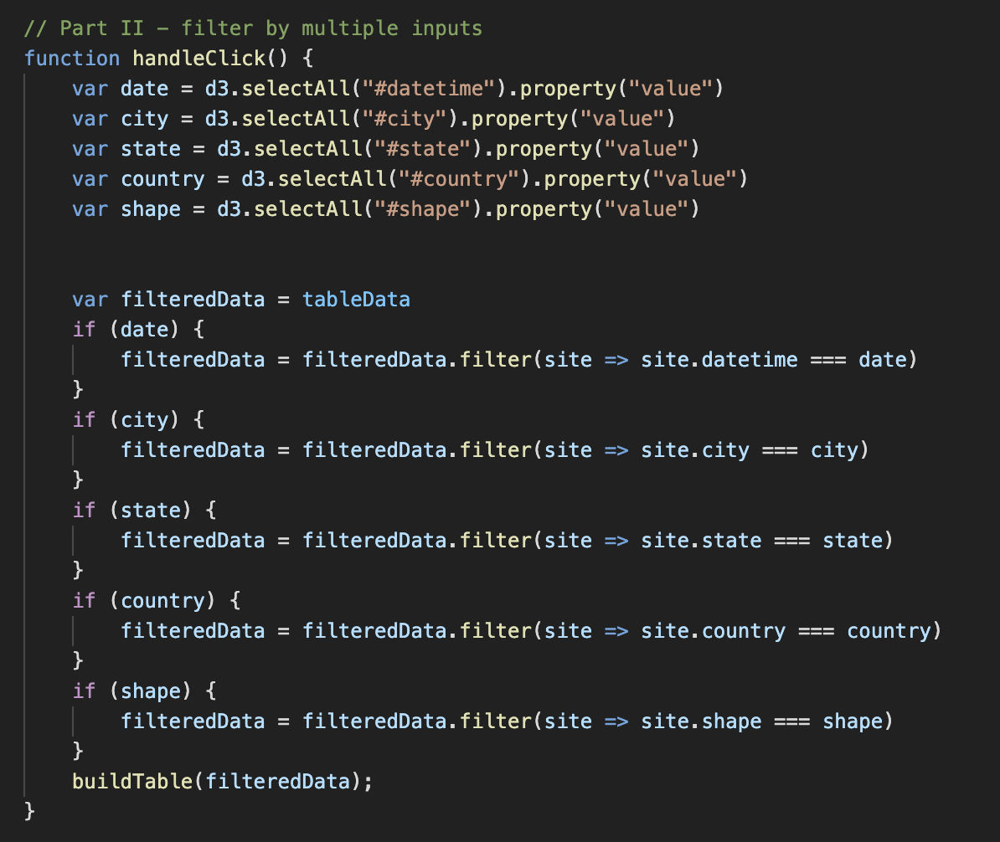
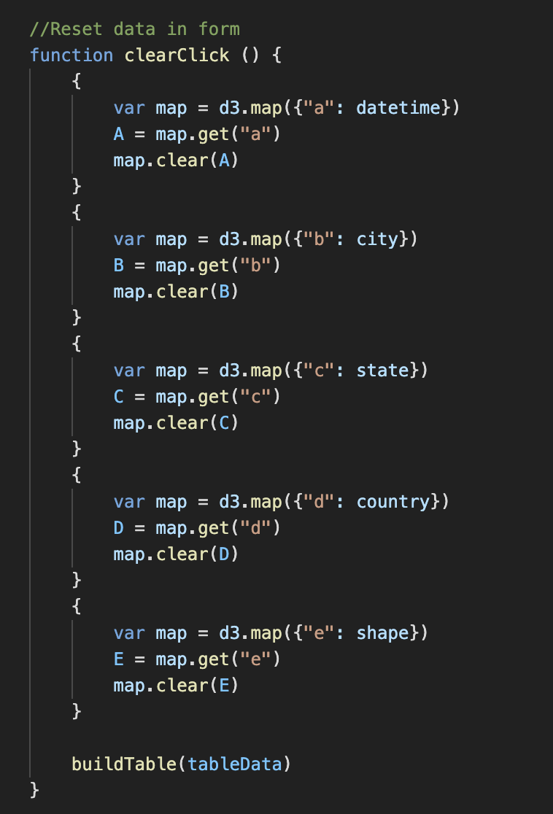
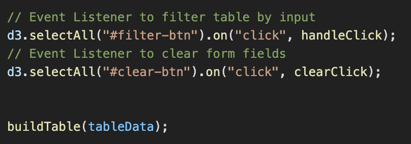

  
   

Using a UFO dataset in the form of an array of JavaScript objects, the below code was written to create a table on a web page and then append new rows of data for each UFO sighting.

This was done by creating a function called "buildTable."  Using d3, the table body was cleared and data composed of multiple arrays was taken in by iterating though each object and appending it's value inside a cell, which was nested inside the table data, nested inside of a table row. 

  

Next, a function called handleClick was created to "listen" for a filter button and read the value entered into the respeective input field.  This returned a search specific to the input or inputs the user entered and rebuilds the table based on the new filtered data.

  

Lastly, a function called clearClick was created to clear any data entered into the input fields and reset the table.  Event listeners were added to handle the event functions and finally rebuild the table when clearClick is called.

  
   

