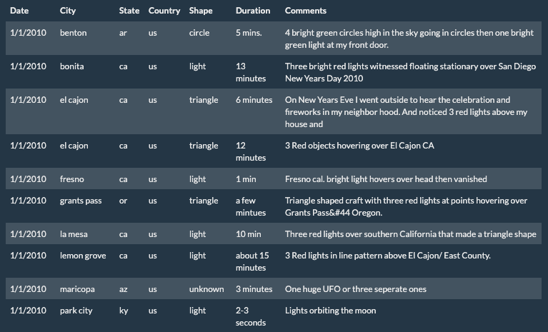

# javascript-challenge

  
   

First, a function called "buildTable" was created using d3 to clear the table body and take in data composed of multiple arrays by iterating though each object and appending it's value inside a cell, which is nested inside of table data, nested inside of a table row. 

Next, a function called handleClick was created which listens for a filter button and reads the value entered into one of the input fields.  This returns a search specific to the inputs the user enters.

Lastly, a function called clearClick was created to clear any data entered into the input fields and reset the table.  
